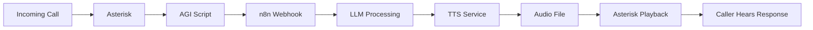

# 🚀 Asterisk + n8n + TTS Telephony Service Implementation Plan

> **Target Environment**: Ubuntu 22.04 LTS on Oracle ARM64 (aarch64)  
> **Public IP**: 140.245.29.28  
> **n8n Instance**: Already running at https://n8n.shravanpandala.me/

## User Review Required

> [!IMPORTANT]
> **SIP Provider Required**: You will need a SIP trunk provider (Twilio, Vonage, Telnyx, or similar) to receive actual phone calls. This plan provides placeholder configurations that you'll update with your provider credentials.

> [!WARNING]
> **Firewall Configuration**: We'll need to open UDP ports 5060-5061 (SIP) and 10000-20000 (RTP) plus TCP 5050 (TTS). Please confirm you have access to your Oracle Cloud Network Security Group (NSG) to add these ingress rules.

---

## Current System State

| Component | Status | Notes |
|-----------|--------|-------|
| OS | ✅ Ubuntu 22.04 LTS (ARM64) | Ready |
| Docker | ✅ v28.4.0 | Ready |
| n8n | ✅ Running | Container active, webhook URL configured |
| Asterisk | ❌ Not installed | Will compile from source for ARM |
| TTS Service | ❌ Not installed | Will deploy via Docker |
| NTP | ✅ Synchronized | Required for SIP timing |

---

## Proposed Changes

### Phase 1: VM and Asterisk Setup

#### 1.1 Install System Prerequisites

Install build tools and dependencies required for Asterisk ARM64 compilation:

```bash
sudo apt update && sudo apt upgrade -y
sudo apt install -y build-essential git wget curl libxml2-dev libncurses5-dev \
  uuid-dev libjansson-dev libsqlite3-dev libssl-dev libedit-dev libsrtp2-dev \
  libspeexdsp-dev libasound2-dev libcurl4-openssl-dev libvorbis-dev libpq-dev \
  unixodbc-dev libnewt-dev xmlstarlet 
```

---

#### 1.2 Download and Compile Asterisk for ARM64

| Step | Action |
|------|--------|
| Download | Get Asterisk 22 LTS (latest stable) |
| Configure | Run prerequisite script and configure |
| Compile | Build with ARM optimizations |

#### [NEW] [install-asterisk.sh](file:///home/ubuntu/Telephony%20Service/scripts/install-asterisk.sh)

Automated installation script that handles downloading, configuring, and compiling Asterisk.

---

#### 1.3 Configure Asterisk Service (Post-Install)

#### [NEW] [pjsip.conf](file:///home/ubuntu/Telephony%20Service/configs/pjsip.conf)

PJSIP transport and endpoint configuration with:
- UDP transport on port 5060
- NAT settings for Oracle VM (externaddr/localnet)
- Placeholder SIP provider credentials

#### [NEW] [extensions.conf](file:///home/ubuntu/Telephony%20Service/configs/extensions.conf)

Dialplan with:
- Incoming call context from SIP provider
- AGI integration for n8n workflow trigger
- TTS playback handling

#### [NEW] [modules.conf](file:///home/ubuntu/Telephony%20Service/configs/modules.conf)

Module loading configuration to enable required features.

---

### Phase 2: Service Integration

#### 2.1 TTS Service Deployment

#### [NEW] [docker-compose.yml](file:///home/ubuntu/Telephony%20Service/docker-compose.yml)

Docker Compose stack including:
- `openai-edge-tts` service on port 5050
- Shared volume for audio file exchange with Asterisk

---

#### 2.2 AGI Connector Script

#### [NEW] [agi-connector.sh](file:///home/ubuntu/Telephony%20Service/scripts/agi-connector.sh)

Shell script to bridge Asterisk and n8n:
1. Receive call data from Asterisk
2. Trigger n8n webhook with caller information
3. Wait for TTS audio file generation
4. Return control to dialplan for playback

#### [NEW] [tts-handler.sh](file:///home/ubuntu/Telephony%20Service/scripts/tts-handler.sh)

Helper script to:
1. Call openai-edge-tts API
2. Convert audio to Asterisk-compatible format
3. Save to sounds directory

---

### Phase 3: n8n Workflow



---

## Verification Plan

### Automated Tests
1. **Asterisk service check**: `sudo systemctl status asterisk`
2. **PJSIP registration**: `asterisk -rx "pjsip show registrations"`
3. **TTS API test**: `curl -X POST http://localhost:5050/v1/audio/speech -d '{"input":"Hello world"}' -o test.mp3`
4. **n8n webhook test**: Trigger test call flow

### Manual Verification
1. Make a test call to the configured number
2. Verify audio playback works correctly
3. Check Asterisk logs for any errors

---

## Firewall Rules Required

| Port | Protocol | Purpose |
|------|----------|---------|
| 5060 | UDP | SIP signaling (PJSIP) |
| 5061 | UDP | SIP TLS (optional) |
| 10000-20000 | UDP | RTP media (voice audio) |
| 5050 | TCP | TTS service API |
| 22 | TCP | SSH (already open) |

---

## File Structure

```
Telephony Service/
├── scripts/
│   ├── install-asterisk.sh     # Asterisk installation
│   ├── agi-connector.sh        # AGI bridge to n8n
│   └── tts-handler.sh          # TTS API helper
├── configs/
│   ├── pjsip.conf              # PJSIP configuration
│   ├── extensions.conf         # Dialplan
│   └── modules.conf            # Module loading
├── sounds/                     # Generated audio files
├── docs/
│   └── setup-guide.md          # Complete setup documentation
├── docker-compose.yml          # TTS service stack
└── task.md                     # Progress tracker
```
